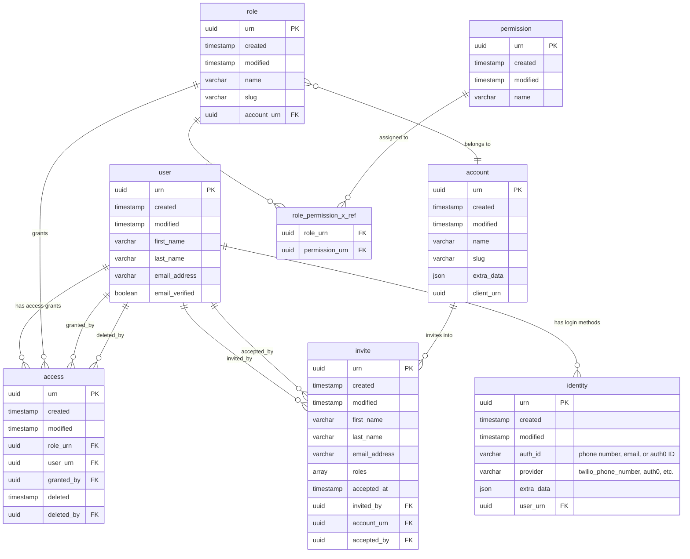

# Auth Database Schema

## Entity Relationship Diagram



## Relationships Summary

```mermaid
flowchart LR
    subgraph "User Management"
        U["👤 user"] -->|"1:N"| I["🔑 identity"]
    end

    subgraph "RBAC"
        AC["🏢 account"] -->|"1:N"| R["🎭 role"]
        R -->|"N:M"| P["🔐 permission"]
        RPX["role_permission_x_ref"]
    end

    subgraph "Access Control"
        U -->|"1:N"| A["🔓 access"]
        R -->|"1:N"| A
    end

    subgraph "Invitations"
        U -->|"invited_by"| INV["📩 invite"]
        AC -->|"into account"| INV
    end
```



## Key Tables for Phone Recovery

| Table | Purpose | Key Columns |
|---|---|---|
| `user` | Stores user profile | `urn`, `first_name`, `last_name`, `email_address` |
| `identity` | Stores login methods | `auth_id` (the actual phone/email), `provider`, `user_urn` |

### Identity Providers

| Provider | auth_id Format | Example |
|---|---|---|
| `twilio_phone_number` | Phone number | `+6592479901` |
| `auth0` | Auth0 ID | `sms\|6145d1b5d1ce9f9dc8d0f257` |

### Phone Recovery Query

```sql
-- Find user
SELECT urn, first_name, last_name, email_address
FROM "user"
WHERE first_name ILIKE '%Antigoni%';

-- Get their phone number
SELECT auth_id
FROM identity
WHERE user_urn = '<user_urn>'
  AND provider = 'twilio_phone_number';
```

## Foreign Key Map

| From | → | To |
|---|---|---|
| `identity.user_urn` | → | `user.urn` |
| `access.user_urn` | → | `user.urn` |
| `access.role_urn` | → | `role.urn` |
| `access.granted_by` | → | `user.urn` |
| `access.deleted_by` | → | `user.urn` |
| `role.account_urn` | → | `account.urn` |
| `role_permission_x_ref.role_urn` | → | `role.urn` |
| `role_permission_x_ref.permission_urn` | → | `permission.urn` |
| `invite.invited_by` | → | `user.urn` |
| `invite.accepted_by` | → | `user.urn` |
| `invite.account_urn` | → | `account.urn` |
